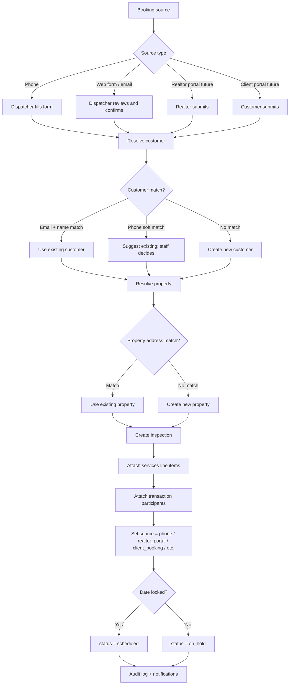
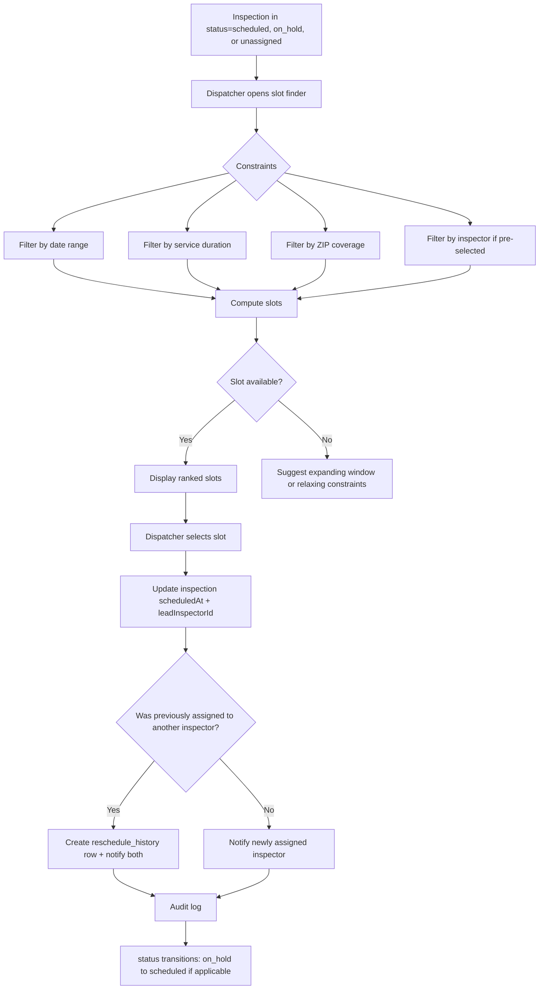
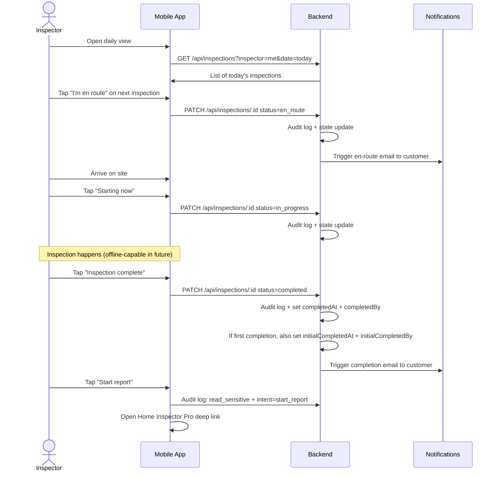
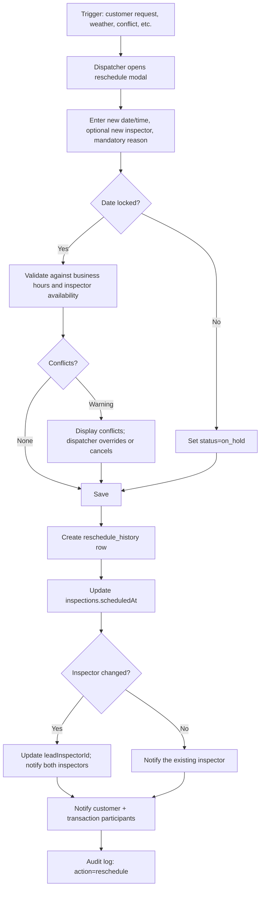
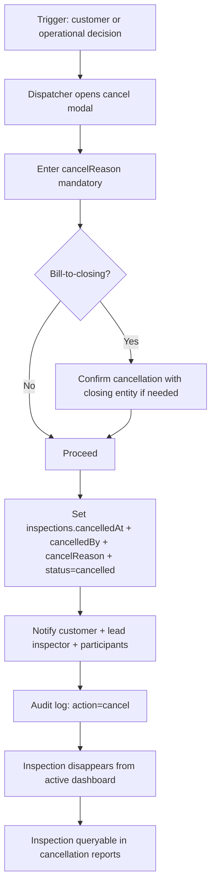
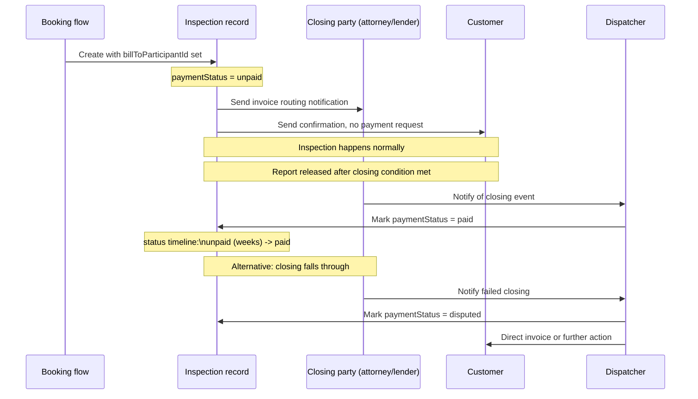

# User Stories and Workflows

_Status: DRAFT, awaiting Troy's review. Companion to `specs/01-schema.ts` (locked) and `specs/04-field-mapping.md` (locked)._

This spec defines the scheduling slice from the perspective of each user role. It drives the API contract (spec 02) and the UI specifications. Stories are written in the standard "As a [role], I want to..., so that..." form with explicit acceptance criteria. Workflows are captured as Mermaid diagrams.

## Table of contents

1. [Roles in scope](#roles-in-scope)
2. [Cross-cutting acceptance criteria](#cross-cutting-acceptance-criteria)
3. [Owner](#owner)
4. [Operations Manager](#operations-manager)
5. [Dispatcher](#dispatcher)
6. [Inspector (Technician)](#inspector-technician)
7. [Realtor (Transaction Participant)](#realtor-transaction-participant)
8. [Client (Customer)](#client-customer)
9. [Workflow diagrams](#workflow-diagrams)
   - [W1. Booking intake (all sources)](#w1-booking-intake-all-sources)
   - [W2. Schedule and assign](#w2-schedule-and-assign)
   - [W3. Day-of inspection](#w3-day-of-inspection)
   - [W4. Reschedule](#w4-reschedule)
   - [W5. Cancellation](#w5-cancellation)
   - [W6. Status state machine](#w6-status-state-machine)
   - [W7. Bill-to-closing payment](#w7-bill-to-closing-payment)
10. [Open questions](#open-questions)

## Roles in scope

This spec covers the roles defined in `roleEnum` (per the v3 schema):

| Role | Source | Description |
|---|---|---|
| `owner` | `user_roles.role='owner'` | Account-level authority. Sees across all businesses they own. Drives policy, settings, reports. |
| `operations_manager` | `user_roles.role='operations_manager'` | Business-level operations leader. Manages dispatch staff, services, scheduling rules. |
| `dispatcher` | `user_roles.role='dispatcher'` | Day-to-day scheduler. Books inspections, assigns inspectors, handles reschedules and cancellations. |
| `technician` | `user_roles.role='technician'` | The field worker. At Safe House, called "inspector." At HCJ "pool tech," at Pest Heroes "pest tech." |
| `client_success` | `user_roles.role='client_success'` | Customer-facing communication and follow-up. Handles client questions, payment chase, report delivery questions. |
| `bookkeeper` | `user_roles.role='bookkeeper'` | Financial reporting, invoicing, QuickBooks export. Read-mostly except for payment reconciliation. |
| `viewer` | `user_roles.role='viewer'` | Read-only role for auditors, partners, or restricted staff. |
| **Realtor** | `transaction_participants` row, no app login (today) | Real estate agents on inspections. Future: realtor portal login. |
| **Client** | `customers` row, no app login (today) | The person who pays for and receives the inspection report. Future: client booking portal. |

Stories below cover Owner, Operations Manager, Dispatcher, Inspector, Realtor, and Client. The remaining roles (`client_success`, `bookkeeper`, `viewer`) get a brief section at the end since their stories overlap with Operations Manager and are read-mostly.

## Cross-cutting acceptance criteria

These apply to every story below unless explicitly overridden.

- **AC-X1.** Every action is auditable. The action produces an `audit_log` row with `action`, `outcome`, `entityType`, `entityId`, `userId`, `accountId`, `businessId`, `sessionId`, `requestId`, `ipAddress`, `userAgent`, `changes`.
- **AC-X2.** Account isolation is enforced at the database layer (RLS) and the API layer. A user from account A cannot see, modify, or even infer the existence of records in account B.
- **AC-X3.** Business isolation is enforced via `user_businesses` membership and `user_roles` per-business roles. A user only sees businesses they belong to within their account.
- **AC-X4.** Sensitive PII reads (customer details, inspection notes containing PII, agreements with signed content) produce `audit_log` entries with `action='read_sensitive'`.
- **AC-X5.** Cancelled, deleted, or inactive records are filtered from default views. Admin views can include them with explicit toggle.
- **AC-X6.** Authentication uses Passport sessions per the existing Replit pattern. MFA enforcement follows `accounts.config.security` policy.
- **AC-X7.** All datetimes display in the user's local timezone (configured per user; default account timezone). Storage is `timestamptz` (UTC) per schema D3.
- **AC-X8.** Forms validate via Zod schemas shared between client and server (existing project pattern).

## Owner

Owners are accountable for the business outcomes and the platform. At Safe House the Owner is also a working inspector and dispatcher in some workflows. Stories assume Owner-only authority unless they overlap with another role.

### O-1. Switch active business context

**As an** Owner with multiple businesses in my account,
**I want to** switch which business I am viewing in one click,
**so that** I can see Safe House, HCJ, or Pest Heroes data without separate logins.

**Acceptance criteria:**

- A business switcher is visible in the persistent UI shell (top bar or sidebar).
- The switcher lists every business the Owner belongs to within their account, ordered by `businesses.displayOrder`.
- Switching changes the active `business_id` in the session. Subsequent UI views and API calls scope to the new business.
- The switch is logged in `audit_log` with `action='view'`, `entity_type='business'`.

### O-2. View account-level dashboard

**As an** Owner,
**I want to** see a roll-up dashboard across all my businesses,
**so that** I can monitor revenue, volume, and operational health without drilling into each business.

**Acceptance criteria:**

- Account dashboard shows: total inspections this month and this quarter (count, revenue), per-business breakdown, top-N inspectors by volume, payment status distribution, signature status distribution, report-released percentage, recent cancellations.
- Numbers are real-time within a 1-minute cache window.
- Drill-down links navigate to the per-business view filtered to the same period.
- Read-only; this view does not allow inspection edits.

### O-3. Manage account configuration

**As an** Owner,
**I want to** view and edit account-level settings,
**so that** I control session timeouts, MFA enforcement, retention, and licensing config without engineering involvement.

**Acceptance criteria:**

- Settings page exposes `accounts.config` keys defined in `accountConfigSchema` (branding, security, notifications, features, licensing).
- MFA toggles for `requireMfaForOwners`, `requireMfaForRoles`, `requireMfaForPiiAccess` editable.
- Session lifetime (`absoluteMaxDays`, idle timeout) editable.
- Audit retention days editable; default 7 (per Troy's directive 2026-04-27).
- Saving produces `audit_log` with `action='update'`, `entity_type='account'`.
- Owner cannot reduce audit retention below a configured floor (currently 1 year) without an additional confirmation step.

### O-4. Add or remove a business in the account

**As an** Owner,
**I want to** create a new business in my account or deactivate an existing one,
**so that** I can adjust my multi-business portfolio without engineering involvement.

**Acceptance criteria:**

- Add business: select type (`inspection | pool | pest | other`), name, slug (unique within account), branding fields. Save creates a `businesses` row with `displayOrder = MAX(displayOrder) + 1` within the account.
- New business gets a fresh `order_number` Postgres sequence created automatically by the application backend.
- Deactivate business: set `status='inactive'`. Existing data preserved; new operational records prevented at the API layer. Soft-delete (deletedAt) is a separate, more destructive action requiring an additional reason input.
- Owner with `requireMfaForOwners=true` must MFA-confirm the deactivation.
- Both actions audit-logged.

### O-5. Run cross-business reports

**As an** Owner with multiple businesses,
**I want to** see customers who have used more than one of my businesses,
**so that** I can identify cross-sell opportunities and customer lifetime value across the account.

**Acceptance criteria:**

- Cross-business report lists customers with `customer_businesses` rows in 2 or more businesses within the account.
- Per row: customer display name, businesses used, first activity date per business, last activity date per business, total spend per business.
- Report is read-only; PII access logs as `read_sensitive`.
- Available export to CSV, audit-logged with `action='export'`.

## Operations Manager

Operations Manager runs the day-to-day for one or more businesses. Below are the most common stories.

### OM-1. Manage technician roster

**As an** Operations Manager,
**I want to** add, deactivate, or update technicians for my business,
**so that** the dispatch board reflects who is actually available.

**Acceptance criteria:**

- Add technician: invite by email. System creates a `users` row with `status='invited'` and a `user_businesses` row in the active business, plus a `user_roles` row with `role='technician'`. Invitation email sent.
- Activate technician (after invite): user accepts invitation, sets password, completes optional MFA enrollment. `users.status` flips to `active`, `users.emailVerifiedAt` populates.
- Deactivate technician: set `user_businesses.status='inactive'`. Their `inspector_hours`, `inspector_zips`, and pending inspections remain; new assignments blocked.
- Reactivate within the same business toggles `user_businesses.status='active'`.
- All actions audit-logged.

### OM-2. Configure technician availability

**As an** Operations Manager,
**I want to** set each technician's recurring weekly hours, time-off, ZIP coverage, and per-service durations,
**so that** the slot-finding algorithm and dispatch board are accurate.

**Acceptance criteria:**

- Per-technician availability page shows recurring `technician_hours` (1 row per day-of-week per shift), upcoming `technician_time_off` windows, `technician_zips` (with priority 1-5), and `technician_service_durations` overrides.
- Adding a recurring shift: select day, start time, end time, optional effective_from / effective_to. Save creates a row.
- Adding time-off: select start datetime, end datetime, optional reason. Save creates a row.
- Adding a ZIP: enter ZIP, set priority (1=primary, 5=will-go). Save creates a row.
- Setting a service duration override: select service, enter minutes. Save creates a row in `technician_service_durations`.
- Editing or deleting any of the above audit-logs the change.

### OM-3. Manage services catalog

**As an** Operations Manager,
**I want to** create, edit, and retire services for my business,
**so that** the booking intake and dispatch use the correct service definitions and fees.

**Acceptance criteria:**

- Services list shows active and inactive services for the active business.
- Add service: name, description, public description, base fee, default duration minutes, optional category, sequence, active.
- Default duration defaults to the per-business-type value (per spec 04). Operations Manager can override.
- Edit service: any field editable; previous version captured in audit_log.
- Retire service: set `active=false`. Existing inspections referencing it remain valid; new inspections cannot select it.
- Inspection-services-line-items referencing a retired service display the historical name in reports; new bookings cannot add the service.

### OM-4. Adjust roles for staff

**As an** Operations Manager,
**I want to** grant or revoke roles for staff in my business,
**so that** permissions match operational responsibility.

**Acceptance criteria:**

- Role grants: add a `user_roles` row for `(user_id, business_id, role)`. Optional `expiresAt` for time-limited grants (vacation coverage, project access).
- Role revocations: delete the row, audit_log captures `action='delete'`, `entity_type='user_role'`.
- Operations Manager cannot grant the `owner` role (only an existing owner can grant `owner`).
- Operations Manager cannot grant any role outside their business.
- Time-limited grants automatically revoke when `expiresAt` passes; a sweep job runs hourly and audit-logs each automatic revocation.

### OM-5. Configure business notification routing

**As an** Operations Manager,
**I want to** set notification routing per business (which emails go to whom),
**so that** the right people get pinged for the right events.

**Acceptance criteria:**

- Per-business notifications page edits keys in `businesses.config.notifications` (dispatchAlertsTo, clientCommsFromAddress, smsFromNumber).
- Adding email recipients validates each email format.
- Test send button on each event configuration sends a sample email/SMS using the configured routing.
- Saving audit-logs the change.

## Dispatcher

Dispatcher is the highest-touch role for the scheduling slice. The dispatcher books inspections, assigns inspectors, and reschedules.

### D-1. Book an inspection (phone intake)

**As a** Dispatcher,
**I want to** create a new inspection from a phone call,
**so that** I can capture the booking while I am on the call with the customer or realtor.

**Acceptance criteria:**

- Booking form captures: customer (search existing or create new), property (search existing or create new), service(s) selected from the catalog, requested date and time, special instructions, transaction participants (buyer agent, listing agent, TC, lender, attorney optional).
- Customer search uses the dedupe rules from spec 04 (email + name match; phone soft suggestion).
- Property search uses lowercased+normalized address dedupe.
- Service selection auto-populates `feeAmount` (sum of `base_fee` from selected services) and `durationMinutes` (sum of service durations or per-technician overrides if a specific technician is pre-selected).
- Requested date/time validates against business hours (account-level config) and produces a warning if the requested slot conflicts with anything (does NOT block; dispatcher decides).
- Inspector assignment is optional at booking; can be left for a later step.
- Save creates `inspections` row with `status='scheduled'` (or `'on_hold'` if no date is locked yet), `source='phone'`, and an `audit_log` row with `action='create'`.
- Save also creates `inspection_participants` rows for each transaction participant attached.
- Save also creates an `inspection_services` row per service selected.
- The inspection appears immediately on the dispatcher dashboard.
- If the customer is new, a `customer_businesses` junction row is created linking the customer to this business with `firstSeenAt=now()`.

### D-2. View dispatcher dashboard

**As a** Dispatcher,
**I want to** see a real-time dashboard of all active inspections in my business,
**so that** I can spot conflicts, gaps, and unassigned work.

**Acceptance criteria:**

- Dashboard lists inspections with `status IN (scheduled, confirmed, en_route, in_progress, on_hold)` and `deletedAt IS NULL`, ordered by `scheduledAt`.
- Each row shows: order number, scheduled date/time, customer name, property address, lead inspector (or "unassigned"), service summary, status badge, payment status badge, signature status badge.
- Filters: date range, inspector, service, status, source.
- Sort options: scheduled time (default), customer name, property zip.
- Bulk select supports reassign-inspector and reschedule operations.
- Refresh interval: 30 seconds, or push-based via WebSocket when implemented.

### D-3. Assign or reassign inspector

**As a** Dispatcher,
**I want to** assign an inspector to an unassigned inspection or change the assigned inspector,
**so that** the dispatch reflects the current plan.

**Acceptance criteria:**

- From the inspection detail or the dashboard, select inspector from a list of active technicians in the business.
- The inspector list shows, for each candidate, their availability for the inspection's scheduled time (green/yellow/red), with a tooltip explaining any conflict (existing inspection, time-off, outside working hours, ZIP not covered).
- Reassignment from one inspector to another writes a `reschedule_history` row with `previousInspectorId`, `newInspectorId`, and a reason text.
- The previously assigned inspector's notification (email/SMS per their preferences) fires with cancellation/reassignment context.
- The newly assigned inspector's notification fires with assignment context.
- Audit-logged.

### D-4. Reschedule an inspection

**As a** Dispatcher,
**I want to** change the scheduled date/time of an inspection,
**so that** I can accommodate customer requests or operational changes.

**Acceptance criteria:**

- Reschedule modal shows current scheduled time, prompts for new date/time, optional inspector reassignment, mandatory reason text (free-form).
- Validation: new time must be in the future, must respect business hours, must not collide with the assigned inspector's existing inspections (warn-not-block).
- Save creates a `reschedule_history` row, increments the conceptual reschedule count (computed on demand from history), updates `inspections.scheduledAt`, optionally updates `inspections.leadInspectorId`.
- Notifications: customer, lead inspector, transaction participants on the inspection (per their preferences).
- Status: stays `scheduled` if a date is locked, transitions to `on_hold` if the new date is "TBD."
- Audit-logged with `action='reschedule'`.

### D-5. Cancel an inspection

**As a** Dispatcher,
**I want to** cancel an inspection,
**so that** the schedule reflects the customer's decision and the inspector is freed up.

**Acceptance criteria:**

- Cancel modal prompts for mandatory `cancelReason` text. Optional cancellation policy fields (refund initiated yes/no, etc.) follow per-business configuration.
- Save sets `inspections.cancelledAt = now()`, `cancelledBy = current user`, `cancelReason`, `status='cancelled'`.
- Notifications: customer, lead inspector, participants.
- The inspection disappears from the active dashboard but is queryable in cancellation reports.
- Audit-logged with `action='cancel'`.
- Distinct from administrative deletion (`deletedAt`); cancellation is operational state, deletion is data-management.

### D-6. Find an available slot

**As a** Dispatcher,
**I want to** ask the system "what slots are available for inspector X over the next 14 days?" or "which inspectors are available at 2pm Thursday?",
**so that** I can answer customer questions on the phone immediately.

**Acceptance criteria:**

- Slot finder UI accepts: optional inspector, date range (defaults to 14 days forward), optional service (drives duration), optional ZIP (filters by inspector ZIP coverage).
- Returns: list of `{inspectorId, scheduledAt, durationMinutes}` candidate slots.
- Algorithm respects: `technician_hours`, `technician_time_off`, existing inspections (with buffer per business config), `technician_zips` priority, service duration.
- Cross-inspector slot computation is cache-friendly per spec 07 Sc7.
- Result includes a "why this slot" explanation for the top suggestions (e.g., "Inspector A, primary territory match, 30-min buffer respected").

### D-7. Handle a no-show

**As a** Dispatcher,
**I want to** mark an inspection as no-show when the customer or property access fails,
**so that** the inspector's day is freed up and the customer is followed up correctly.

**Acceptance criteria:**

- From inspection detail, select "No Show." Modal prompts for reason and whether a fee applies per business policy.
- Save sets `status='no_show'`, optionally creates a billing event for the no-show fee.
- Notifications: customer (with reschedule link), participants.
- Audit-logged.

## Inspector (Technician)

Inspectors work primarily on mobile. Stories assume mobile-first UI.

### I-1. View today's schedule

**As an** Inspector,
**I want to** see my inspections for today and the next 7 days at a glance on my phone,
**so that** I know where I am going and when.

**Acceptance criteria:**

- Daily view defaults to today; swipe or pick to navigate days.
- Each inspection card shows: scheduled time, customer name, property address (tap to open in Maps), service summary, special instructions (collapsed by default).
- Tap to drill into the inspection detail.
- Cards display in chronological order.
- Drive-time hint between consecutive inspections (estimated; pulls from a maps service in a later slice).

### I-2. View inspection detail

**As an** Inspector,
**I want to** see all the operational detail for an upcoming inspection,
**so that** I can prepare and arrive ready.

**Acceptance criteria:**

- Detail page shows: customer contact info (with click-to-call/click-to-email), property full address with map, services to perform, special instructions, internal notes, transaction participants (buyer agent, listing agent, TC, lender, attorney; with click-to-call), agreement status (signed/unsigned), payment status, custom fields.
- Click-to-call dials the contact's primary phone.
- Map link opens default mobile maps app to the property address.
- Read-only on most fields; editable: special instructions can be appended (not overwritten); a "field notes" textarea adds to `inspection_notes` (out of scope for v3 schema lock; reused from existing Replit project).
- Sensitive PII reads here trigger `read_sensitive` audit_log entries.

### I-3. Confirm en route, in progress, complete

**As an** Inspector,
**I want to** mark status as I arrive, start, and finish,
**so that** the office and the customer have real-time visibility into the day.

**Acceptance criteria:**

- One-tap status transitions: "I'm en route", "Starting now", "Inspection complete."
- Each transition updates `inspections.status`, captures the timestamp.
- "Inspection complete" sets `completedAt` and `completedBy`. If this is the first completion event, also sets `initialCompletedAt` and `initialCompletedBy`.
- A QA reopen later (set `qaStatus='in_review'`, then back to `not_reviewed`) followed by a recompletion preserves `initialCompletedAt` and overwrites `completedAt`.
- Each transition produces an `audit_log` row.

### I-4. Capture inspection findings (links to report tool)

**As an** Inspector,
**I want to** kick off the report-writing workflow from this inspection,
**so that** I do not have to copy property and customer data into the report tool.

**Acceptance criteria:**

- "Start report" button on inspection detail.
- Behavior: integration-dependent. For Home Inspector Pro (Safe House's tool), opens the HIP app or web view with property and customer data pre-populated where possible.
- Out of scope for v3 schema lock; integration design happens in the report-delivery slice.
- For now: button creates an `audit_log` entry with `action='view'`, `entity_type='inspection'`, `metadata.intent='start_report'`.

### I-5. Submit field notes

**As an** Inspector,
**I want to** attach notes to an inspection from the field,
**so that** the office knows about access issues, additional services discussed, etc.

**Acceptance criteria:**

- Free-text textarea on inspection detail.
- Save appends to `inspection_notes` (existing Replit project table; reused).
- Notes are visible to dispatcher and operations manager; not surfaced to customer or realtor.
- Audit-logged.

### I-6. View my schedule on a wider time window

**As an** Inspector,
**I want to** look ahead a week or two, or back a few days,
**so that** I can plan personal commitments and reference what I did.

**Acceptance criteria:**

- Week view and month view in the mobile app.
- Past inspections show with completed status and read-only detail.
- Future inspections show with status and editable status transitions.

## Realtor (Transaction Participant)

Realtors do not have app login at v3 schema lock; they are `transaction_participants` rows attached via `inspection_participants`. Stories below describe what a future realtor portal supports; today these are partially covered by the dispatcher acting on the realtor's behalf.

### R-1. Request an inspection (future portal)

**As a** Realtor,
**I want to** request an inspection for my buyer client through a portal,
**so that** I do not have to call the dispatcher to book.

**Acceptance criteria (future, post-v3):**

- Realtor authenticates via portal-specific token or future SSO.
- Booking form captures customer (the realtor enters buyer details), property (address + metadata), service(s) selected, preferred date(s) and time window.
- Submit creates an `inspections` row with `status='scheduled'` or `'on_hold'`, `source='realtor_portal'`, `sourceParticipantId=<the realtor's transaction_participants id>`.
- Realtor receives confirmation email with the assigned date/time once dispatch confirms.
- Audit-logged.

### R-2. View my client's inspection details

**As a** Realtor,
**I want to** see the inspections where I am a participant,
**so that** I can track status, see the schedule, and pull reports.

**Acceptance criteria:**

- Portal view lists all inspections where the authenticated realtor is on the `inspection_participants` junction.
- Per row: customer name, property address, scheduled date, status, payment status, signature status, report-released indicator, inspection type.
- Drill-down to inspection detail shows: customer info (with phone/email per the customer's opt-in flags; restricted PII access), property info, schedule, status, and link to the report when released.
- PII reads are audit-logged with `read_sensitive`.

### R-3. Forward report to my client

**As a** Realtor,
**I want to** download or email-forward the inspection report to my buyer client,
**so that** they have it for their decision.

**Acceptance criteria:**

- Report download link visible only when `inspections.reportReleased=true`.
- Download triggers `audit_log` with `action='export'`, `entity_type='inspection'`, `metadata.export_kind='report_pdf'`.
- Email-forward uses the configured Resend integration; subject and body are templated; recipient is the customer's email (read-only; realtor cannot redirect to arbitrary email addresses).

## Client (Customer)

Clients do not have app login at v3 schema lock. Stories describe a future booking portal; today these are partially covered by the dispatcher.

### C-1. Book an inspection (future portal)

**As a** Customer,
**I want to** book an inspection without calling,
**so that** I can act on my own schedule.

**Acceptance criteria (future, post-v3):**

- Public booking page accessible at the business's domain.
- Form captures: customer info (name, email, phone), property address, service(s) selected, preferred date(s) and time window, optional realtor info.
- Submit creates `customers` row (or matches existing per dedupe rules), `properties` row (or matches), `inspections` row with `source='client_booking'`, `inspection_participants` row for the realtor if provided.
- Email confirmation sent on submit; second confirmation when dispatch finalizes.
- Audit-logged.

### C-2. Sign agreement

**As a** Customer,
**I want to** sign the inspection agreement online,
**so that** the inspection can proceed.

**Acceptance criteria:**

- Agreement signing flow exists in the existing Replit project; reused as-is for v3.
- Signed agreement updates `inspections.signatureStatus='signed'`.
- Notification to dispatcher when signing completes.

### C-3. Pay for the inspection

**As a** Customer,
**I want to** pay online,
**so that** I do not have to coordinate payment on the day of inspection.

**Acceptance criteria:**

- Stripe-backed payment page (Stripe is the target processor per existing config).
- Payment success updates `inspections.paymentStatus='paid'`.
- Bill-to-closing customers do NOT see this option; their payment routing is to the closing attorney/lender per `inspections.billToParticipantId`.

### C-4. Receive and download the report

**As a** Customer,
**I want to** receive my inspection report by email and be able to re-download it,
**so that** I have permanent access.

**Acceptance criteria:**

- Email sent on `inspections.reportReleased=true` containing a tokenized download link.
- Token-based download requires email match for re-download (no app login required).
- Download audit-logged.

## Other roles (brief)

### Client Success

Read-mostly access to inspections, customers, and communications. Can update customer contact info, send manual emails/SMS via templates, and resolve communication holds. Cannot create or cancel inspections.

### Bookkeeper

Read access to inspections and payment events for the active business. Write access to mark payments reconciled and trigger QuickBooks export. Cannot edit inspection details or staff records.

### Viewer

Read-only across the business they are assigned to. Used for auditors, partners, or restricted staff. Cannot trigger any action that modifies state.

## Workflow diagrams

Mermaid diagrams capturing the operational flows the stories above reference.

### W1. Booking intake (all sources)



### W2. Schedule and assign



### W3. Day-of inspection



### W4. Reschedule



### W5. Cancellation



### W6. Status state machine

```mermaid
stateDiagram-v2
    [*] --> scheduled : booking with date locked
    [*] --> on_hold : booking without date locked

    on_hold --> scheduled : reschedule with date locked
    scheduled --> on_hold : reschedule without date

    scheduled --> confirmed : customer confirms via portal or comms
    scheduled --> cancelled : dispatcher cancels
    confirmed --> cancelled : dispatcher cancels

    confirmed --> en_route : inspector taps "I'm en route"
    scheduled --> en_route : inspector taps en route without explicit confirm

    en_route --> in_progress : inspector taps "Starting now"
    in_progress --> completed : inspector taps "Complete"
    in_progress --> no_show : dispatcher marks no_show

    en_route --> no_show : inspector reports access failure

    completed --> [*] : terminal
    cancelled --> [*] : terminal
    no_show --> [*] : terminal

    note right of completed : QA reopen path: completed -> in_progress\n(initialCompletedAt preserved)
```

### W7. Bill-to-closing payment



## Open questions

1. **Realtor portal authentication.** Stories assume future portal login; v3 schema does not provide a `transaction_participant` login pattern. Open: token-based access (per-inspection or per-realtor), full SSO with email verification, or magic-link?

2. **Client portal authentication.** Same question for customers. Token + email magic-link is the lowest-friction path; full account creation is heavier.

3. **WebSocket vs polling for dispatcher dashboard.** AC says "30 seconds, or push-based via WebSocket when implemented." Decision needed when the implementation slice opens.

4. **Drive-time integration.** AC for I-1 mentions a drive-time hint between consecutive inspections. Provider (Google Maps, Mapbox) and integration design out of scope for v3 schema lock.

5. **Slot algorithm caching.** Spec 07 Sc7 sketches the caching strategy. The implementation slice picks the cache backend (Redis, in-process LRU, etc.).

6. **Bulk operations.** D-2 mentions bulk select for reassign and reschedule. Volume threshold and rate limits TBD.

7. **No-show fee policy.** D-7 references a per-business no-show fee. Policy storage is `businesses.config` or a future `business_policies` table. Decision deferred.

8. **Field-notes table.** I-5 references `inspection_notes`, which exists in the existing Replit project but was not refreshed in v3 schema. Reused as-is for now; revisit if multi-business surfaces a need for differentiation.

9. **Custom field UI.** Inspections have `customFields jsonb`. UI for displaying and editing custom fields is operational; not specified here. Decision: per-business config defines which keys are surfaced in the form vs hidden.

10. **Dashboard cross-business view for owner.** O-2 describes account-level dashboard with per-business breakdown. Implementation requires UNION queries across operational tables; spec 07 Sc5 covered the inspection-level cross-business query. Pool jobs and pest treatments are not built; the account dashboard for now shows inspection data only.
